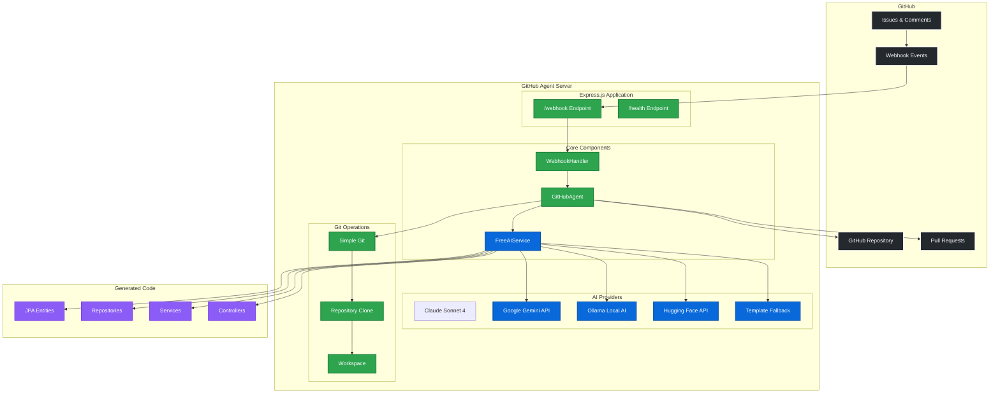
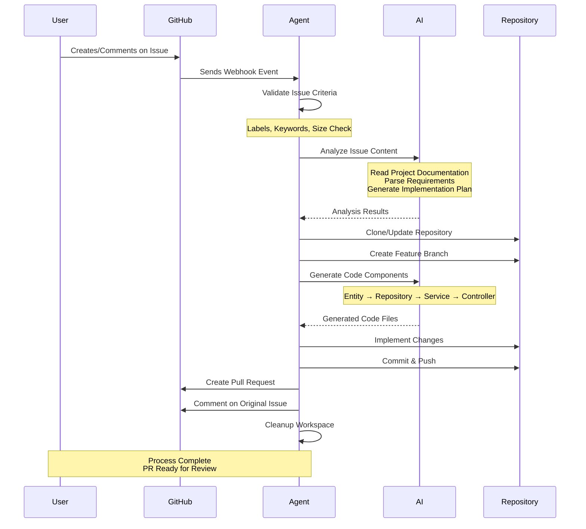
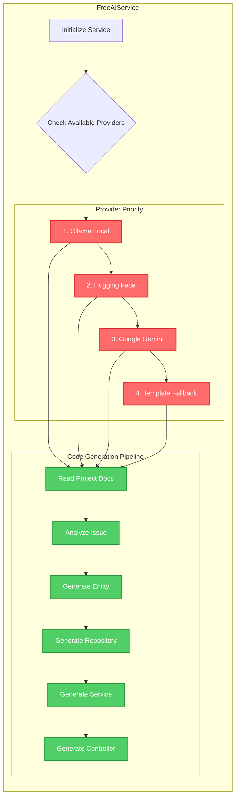
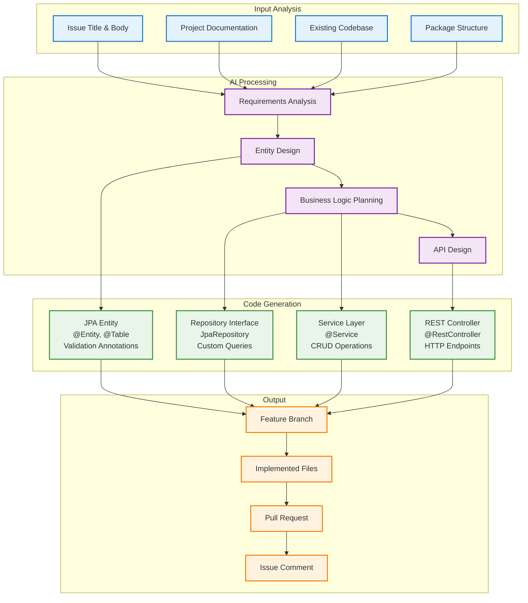

# GitHub Agent - AI-Powered Fullstack Developer Bot

A production-ready GitHub automation agent that acts as a comprehensive fullstack developer, automatically listening to GitHub issues and implementing complete solutions by creating branches and pull requests with **FREE AI integration** and intelligent multi-provider fallback system.

## 🚀 Enhanced Features

- **🧠 Multi-Provider AI System**: Claude Sonnet 4 (primary), Google Gemini, Ollama (local), Hugging Face with intelligent fallback chain
- **🤖 Advanced Code Generation**: AI-powered Java Spring Boot entity, repository, service, and controller generation with quality scoring
- **📋 Robust Template Fallback**: Always functional even when all AI services are unavailable
- **🪝 Secure Webhook Integration**: Real-time GitHub webhook event processing with signature validation
- **🧠 Context-Aware Analysis**: Intelligent issue processing with project documentation integration (README, package.json, copilot-instructions)
- **🌳 Smart Branch Management**: Automated feature branch creation with sanitized naming conventions
- **💻 Complete Implementation**: Full-stack Spring Boot application structure generation with best practices
- **🔄 Automated Pull Requests**: Detailed PRs with implementation summaries, code explanations, and testing guidance
- **🛡️ Enterprise-Grade Error Handling**: Comprehensive error handling with transparent issue comments and fallback mechanisms
- **📚 Documentation Intelligence**: Reads and understands project context for consistent code generation
- **⏱️ Configurable Timeouts**: Extended processing time (10-minute default) with progress monitoring
- **🔒 Security-First Design**: Webhook signature validation, secure token handling, and safe repository operations

## 🏗️ Architecture

### System Overview



### Detailed Workflow



### AI Service Architecture



### File Structure

```
src/
├── index.ts                 # Express server and webhook endpoint
├── agent/
│   └── GitHubAgent.ts      # Core automation logic with AI integration
├── services/
│   └── FreeAIService.ts    # Multi-provider AI service (Ollama, HF, Gemini)
└── webhooks/
    └── WebhookHandler.ts   # GitHub webhook event processing
```

## 🎯 AI-Powered Code Generation

The agent can generate complete Spring Boot applications including:
- **Entities**: JPA entities with proper annotations and validation
- **Repositories**: JpaRepository interfaces with custom query methods
- **Services**: Business logic with CRUD operations
- **Controllers**: REST endpoints with proper HTTP methods
- **Project Context**: Uses existing project patterns and conventions

### Code Generation Flow



## 📋 Prerequisites

- Node.js 16+ and npm
- GitHub Personal Access Token with repository permissions
- GitHub repository with webhook configuration
- **Optional**: AI service setup for intelligent code generation (Ollama recommended)

## 🛠️ Setup

### 1. Clone and Install

```bash
git clone <your-repo-url>
cd githubagent
npm install
```

### 2. Environment Configuration

Copy the example environment file and configure your settings:

```bash
cp .env.example .env
```

Edit `.env` with your configuration:

```env
# GitHub Configuration (Required)
GITHUB_TOKEN=your_github_personal_access_token_here
WEBHOOK_SECRET=your_webhook_secret_here

# Server Configuration
PORT=3000
WORKSPACE_DIR=./workspace

# AI Provider Configuration - Multiple providers with intelligent fallback
# The system will try providers in order: Claude → Gemini → Ollama → HuggingFace → Templates

# Primary Provider: Claude Sonnet 4 (Anthropic API - RECOMMENDED for best quality)
# Get API key from: https://console.anthropic.com
# Most capable AI for professional-grade code generation and analysis
ANTHROPIC_API_KEY=your_anthropic_api_key_here

# Secondary Provider: Google Gemini (Generous Free Tier) 
# Get free API key from: https://makersuite.google.com
# Excellent fallback with generous usage limits
GOOGLE_API_KEY=your_google_api_key_here

# Local Provider: Ollama (100% Free, Offline AI)
# 1. Download from: https://ollama.ai
# 2. Install model: ollama pull codellama:7b  (or qwen2:0.5b for faster responses)
# 3. Start service: ollama serve
OLLAMA_URL=http://localhost:11434
OLLAMA_MODEL=codellama:7b

# Backup Provider: Hugging Face (Free Tier)
# Get free API key from: https://huggingface.co/settings/tokens
HUGGINGFACE_API_KEY=your_hf_token_here

# Additional Configuration
TIMEOUT_MINUTES=10  # AI operation timeout
LOG_LEVEL=info      # Logging level (debug, info, warn, error)
```

### 3. AI Service Setup (Multi-Provider Configuration)

#### 🥇 Primary: Claude Sonnet 4 (Recommended - Highest Quality)
```bash
# 1. Create account at https://console.anthropic.com
# 2. Navigate to API Keys section
# 3. Generate new API key
# 4. Add to .env: ANTHROPIC_API_KEY=your_key
# 
# Benefits:
# - Highest code quality and understanding
# - Best at following complex requirements
# - Superior error handling and edge cases
# - Most accurate Spring Boot code generation
```

**Advantages:**
- Most capable AI for code generation
- Excellent context understanding
- Superior code quality and patterns
- Best for complex Spring Boot implementations

#### 🥈 Option 2: Google Gemini (Generous Free Tier)
```bash
# 1. Get free API key from https://makersuite.google.com
# 2. Add to .env: GOOGLE_API_KEY=your_key
```

#### 🥉 Option 3: Ollama (100% Free, Local)
```bash
# 1. Download and install Ollama from https://ollama.ai

# 2. Install a lightweight code model (recommended)
ollama pull codellama:7b

# For faster responses (smaller model):
ollama pull qwen2:0.5b

# 3. Start Ollama service
ollama serve

# 4. Ollama will run on http://localhost:11434 (default)
```

#### � Option 4: Hugging Face (Free Tier)
```bash
# 1. Create free account at https://huggingface.co
# 2. Get API token from profile settings
# 3. Add to .env: HUGGINGFACE_API_KEY=your_token
```

### 4. GitHub Token Setup

1. Go to GitHub Settings → Developer settings → Personal access tokens → Tokens (classic)
2. Create a new token with these permissions:
   - `repo` (Full control of private repositories)
   - `issues` (Read and write access to issues)
   - `pull_requests` (Read and write access to pull requests)
3. Copy the token and add it to your `.env` file

### 5. Webhook Configuration

1. Go to your repository Settings → Webhooks
2. Add a new webhook:
   - **Payload URL**: `https://your-domain.com/webhook` (or use ngrok for local testing)
   - **Content type**: `application/json`
   - **Secret**: Use the same value as `WEBHOOK_SECRET` in your `.env`
   - **Events**: Select "Issues" and "Issue comments"

## 🚀 Running the Application

### Development Mode
```bash
npm run dev
```

### Production Mode
```bash
npm run build
npm start
```

### Available Scripts

- `npm run dev` - Start development server with hot reloading and TypeScript compilation
- `npm run build` - Build TypeScript to JavaScript in dist/ directory
- `npm start` - Start production server from compiled JavaScript

## 🔧 How It Works

### Issue Processing Workflow

1. **Webhook Received**: GitHub sends webhook for issue events
2. **Issue Analysis**: AI analyzes issue title, body, labels, and project documentation
3. **Repository Setup**: Clones or updates the target repository
4. **Branch Creation**: Creates feature branch `issue-{number}-{sanitized-title}`
5. **Code Generation**: AI generates Spring Boot components based on requirements
6. **Implementation**: Creates entities, repositories, services, and controllers
7. **Commit & Push**: Commits changes with detailed messages
8. **Pull Request**: Creates PR with implementation summary and links
9. **Notification**: Comments on original issue with PR link and cleanup

### Issue Processing Criteria

The agent processes issues that meet any of these criteria:

1. **Labels**: Issues labeled with `auto-fix`, `bot-help`, `enhancement`, `bug`, or `feature`
2. **Keywords**: Issues containing:
   - `implement`, `add feature`, `create`, `build`, `fix`
   - `add entity`, `create repository`, `new service`
   - `spring boot`, `jpa`, `controller`, `rest api`
3. **Size**: Issues with reasonable description length (10-5000 characters)

### Comment Triggers

The agent can also be triggered by comments containing:
- `bot fix this` / `/fix` / `/implement`
- `auto-implement` / `please implement this`
- `can you fix this` / `bot help`

### AI-Enhanced Features

- **Project Context**: Reads README.md, .github/copilot-instructions.md, and package.json
- **Code Pattern Recognition**: Follows existing project conventions and patterns
- **Intelligent Entity Generation**: Creates JPA entities with proper annotations
- **Repository Generation**: Generates JpaRepository with custom query methods
- **Service Layer**: Creates business logic with CRUD operations
- **REST Controllers**: Generates endpoints with proper HTTP methods
- **10-Minute Timeout**: Extended processing time for complex AI analysis

## 🎯 API Endpoints

- `GET /health` - Health check endpoint
- `POST /webhook` - GitHub webhook endpoint for issue events

## � Example Issue Processing

**Input Issue:**
```
Title: "Add Product entity with REST API"
Body: "Create a Product entity with name, price, description fields and CRUD operations"
Labels: ["enhancement", "feature"]
```

**Generated Code:**
- `Product.java` - JPA entity with validation annotations
- `ProductRepository.java` - JpaRepository interface with custom queries
- `ProductService.java` - Business logic with CRUD operations
- `ProductController.java` - REST endpoints for all operations

**AI Features:**
- Follows existing project patterns and package structure
- Uses project's naming conventions and coding standards
- Integrates with existing database configuration
- Maintains consistency with other entities in the project

## 🔮 Recent Enhancements

- **Multi-Provider AI**: Support for Ollama, Hugging Face, and Google Gemini
- **Documentation Integration**: AI reads project documentation for better context
- **Extended Timeouts**: 10-minute processing time for complex analysis
- **Workspace Cleanup**: Automatic cleanup after issue processing
- **Template Fallback**: Robust fallback system when AI is unavailable
- **Project Pattern Recognition**: Follows existing codebase conventions

## 🧪 Testing

### Local Development with Webhooks

For local testing with webhooks, use [ngrok](https://ngrok.com/):

```bash
# In one terminal, start the server
npm run dev

# In another terminal, expose the local server
ngrok http 3000

# Use the ngrok HTTPS URL as your webhook URL in GitHub
# Example: https://abc123.ngrok.io/webhook
```

### Testing AI Integration

1. **Test Ollama**: Ensure Ollama is running and model is installed
   ```bash
   ollama list  # Check installed models
   ollama serve # Start service
   ```

2. **Test Health Endpoint**: Visit `http://localhost:3000/health`

3. **Monitor Logs**: Watch console for AI service initialization and processing

## 📝 Logging

The application provides comprehensive logging:
- **AI Service Initialization**: Shows which AI provider is active
- **Issue Processing**: Detailed workflow progress
- **Repository Operations**: Git operations and file changes
- **Error Handling**: Clear error messages and fallback actions
- **Performance**: Processing times and timeouts

Example logs:
```
✅ Ollama AI service initialized successfully
🤖 Using model: codellama:7b
🔍 Processing issue #42: Add User entity with authentication
✅ AI analysis completed successfully
🌳 Created branch: issue-42-add-user-entity-authentication
📝 Generated 4 files: Entity, Repository, Service, Controller
🔄 Created pull request #43
✅ Issue processing completed in 45.2s
```

## 🛠️ Technology Stack

- **Runtime**: Node.js 16+ with TypeScript
- **Server**: Express.js with webhook handling
- **GitHub Integration**: @octokit/rest and @octokit/webhooks
- **Git Operations**: simple-git for repository management
- **AI Services**: 
  - Ollama (local, free)
  - Hugging Face API (free tier)
  - Google Gemini (generous free tier)
- **Development**: nodemon with hot reloading
- **Language**: TypeScript with strict type checking

## 🤝 Contributing

1. Fork the repository
2. Create a feature branch
3. Make your changes
4. Add tests if applicable
5. Submit a pull request

## 📄 License

ISC License - see LICENSE file for details.

## 🆘 Troubleshooting

### Common Issues

1. **AI Service Not Available**
   - **Ollama**: Check if service is running (`ollama serve`)
   - **Models**: Verify model is installed (`ollama list`)
   - **Fallback**: Agent uses templates when AI is unavailable

2. **Webhook Issues**
   - Verify webhook URL is accessible (use ngrok for local testing)
   - Check webhook secret matches your `.env` configuration
   - Ensure webhook events include "Issues" and "Issue comments"

3. **GitHub API Issues**
   - Verify token has correct permissions (repo, issues, pull_requests)
   - Check rate limits in GitHub API responses
   - Ensure bot has access to target repositories

4. **Repository Operations**
   - Verify write access to target repository
   - Check if branch protection rules block bot operations
   - Ensure workspace directory is writable

5. **AI Timeouts**
   - Current timeout is 10 minutes for complex analysis
   - Check Ollama model size (smaller models like qwen2:0.5b are faster)
   - Monitor system resources for local AI processing

### Debug Mode

For verbose logging, check the console output during development:
```bash
npm run dev
```

Monitor logs for:
- AI service initialization status
- Issue processing workflow
- Error messages and fallback actions
- Performance metrics and timeouts

### Performance Optimization

- **Faster AI**: Use `qwen2:0.5b` model for quicker responses
- **Memory**: Ensure sufficient RAM for local AI models
- **Network**: Stable connection for API-based AI services
- **Storage**: Adequate disk space for repository cloning
