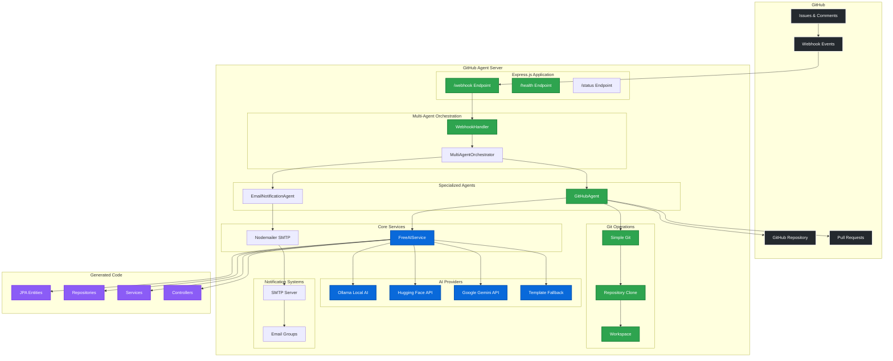
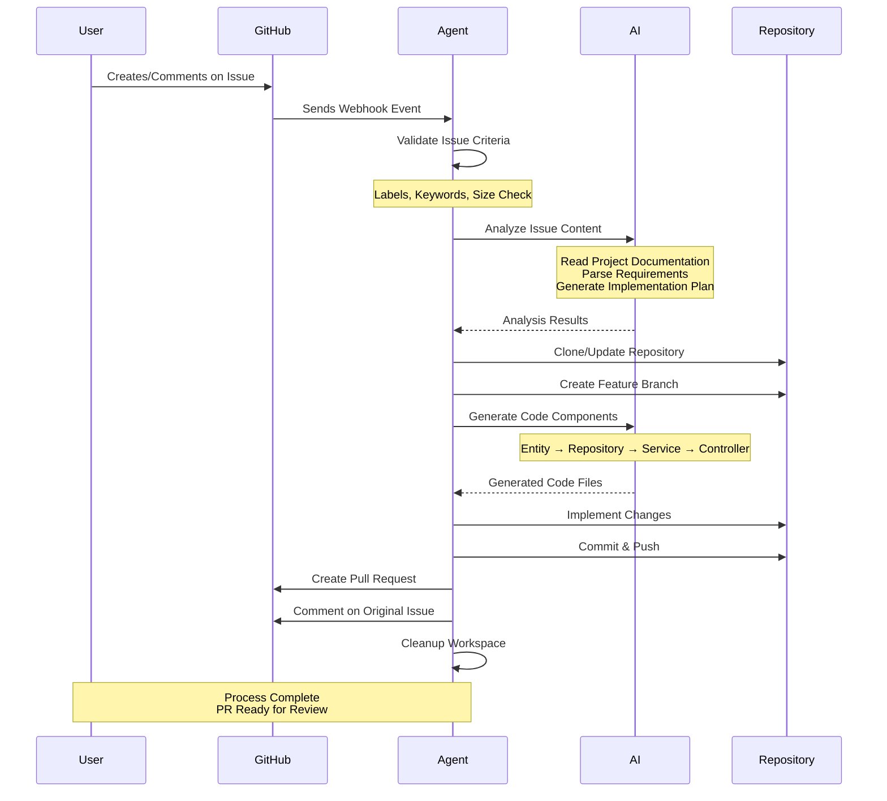
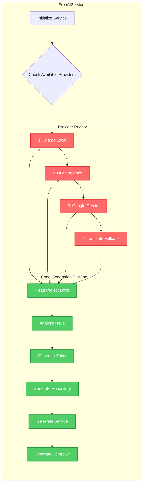
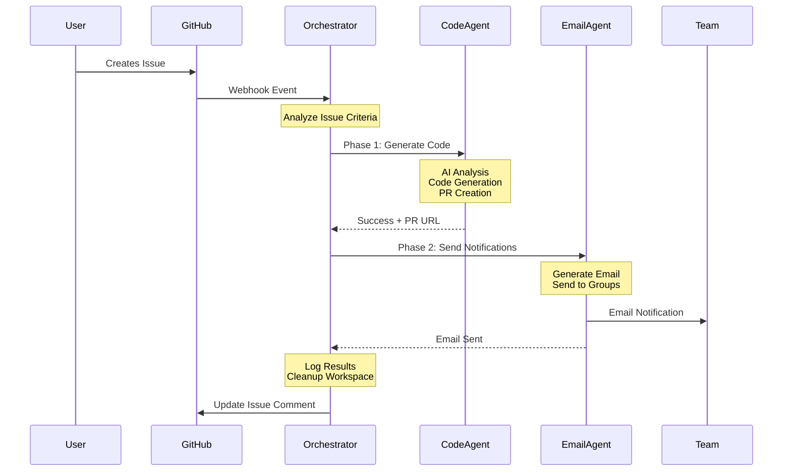
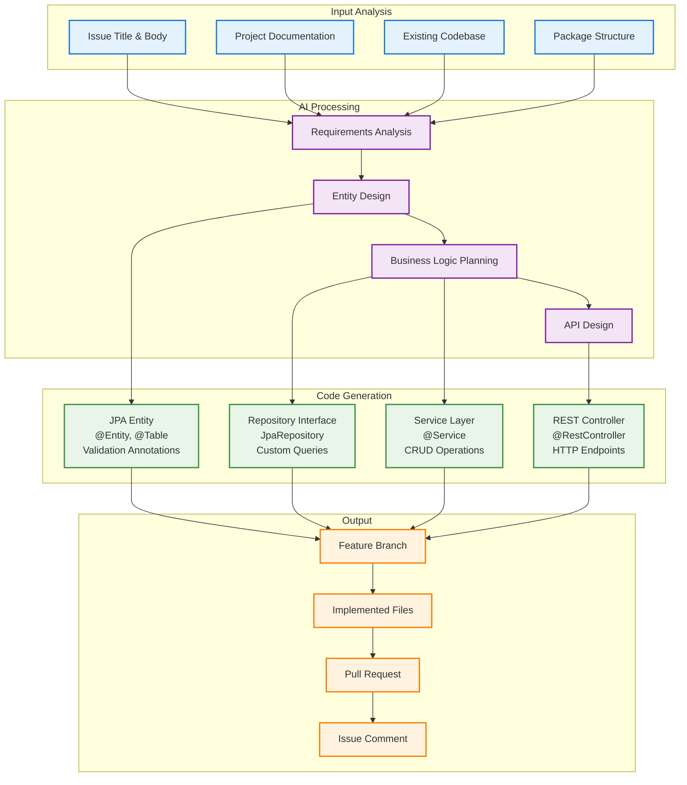

# GitHub Agent - Fullstack Developer Bot

A GitHub automation agent that acts as a fullstack developer, automatically listening to GitHub issues and implementing solutions by creating branches and pull requests with **FREE AI integration** and **Multi-Agent Orchestration**.

## 🚀 Features

- **🎭 Multi-Agent Orchestration**: Coordinated agents for code generation and email notifications
- **🆓 Multiple Free AI Options**: Ollama (local), Hugging Face, Google Gemini with intelligent fallback
- **🤖 Smart Code Generation**: AI-powered Java Spring Boot entity, repository, service, and controller generation
- **� Email Notifications**: Automated team notifications when PRs are created
- **�📋 Template Fallback**: Always functional even without AI services
- **🪝 Webhook Integration**: Real-time GitHub webhook event processing
- **🧠 Intelligent Issue Analysis**: Context-aware issue processing with project documentation integration
- **🌳 Automated Branch Creation**: Feature branches with sanitized naming
- **💻 Full-Stack Implementation**: Complete Spring Boot application structure generation
- **🔄 Pull Request Automation**: Detailed PRs with implementation summaries
- **🛡️ Robust Error Handling**: Comprehensive error handling with transparent issue comments
- **📚 Documentation-Aware**: Reads project README, copilot instructions, and package.json for context
- **⏱️ Configurable Timeouts**: Extended processing time with orchestration monitoring

## 🏗️ Architecture

### System Overview



### Detailed Workflow



### AI Service Architecture



### File Structure

```
src/
├── index.ts                 # Express server and webhook endpoint
├── agent/
│   └── GitHubAgent.ts      # Core automation logic with AI integration
├── services/
│   └── FreeAIService.ts    # Multi-provider AI service (Ollama, HF, Gemini)
└── webhooks/
    └── WebhookHandler.ts   # GitHub webhook event processing
```

## � Multi-Agent Orchestration

The system uses a sophisticated multi-agent architecture that coordinates specialized agents to handle different aspects of issue processing:

### Orchestration Flow



### Agent Responsibilities

| Agent | Responsibility | Dependencies |
|-------|---------------|-------------|
| **MultiAgentOrchestrator** | Coordinates all agents, manages timeouts, logs results | All agents |
| **GitHubAgent** | Code generation, Git operations, PR creation | FreeAIService, simple-git |
| **EmailNotificationAgent** | Team notifications, email formatting | nodemailer, SMTP |
| **FreeAIService** | AI-powered analysis and code generation | Ollama/HF/Gemini |

### Configuration Options

```typescript
// Multi-agent configuration
const orchestratorConfig = {
  enableEmailNotifications: true,
  emailGroups: ['developers', 'managers', 'qa'],
  timeout: 15 * 60 * 1000, // 15 minutes
}
```

### Error Handling & Fallbacks

- **Code Generation Failures**: Uses template fallback, continues with email if configured
- **Email Failures**: Logs error but doesn't block workflow, code generation still succeeds
- **Timeout Handling**: 15-minute timeout per phase, graceful degradation
- **Service Unavailability**: Each agent has independent fallback mechanisms

## �🎯 AI-Powered Code Generation

The agent can generate complete Spring Boot applications including:
- **Entities**: JPA entities with proper annotations and validation
- **Repositories**: JpaRepository interfaces with custom query methods
- **Services**: Business logic with CRUD operations
- **Controllers**: REST endpoints with proper HTTP methods
- **Project Context**: Uses existing project patterns and conventions

### Code Generation Flow



## 📋 Prerequisites

- Node.js 16+ and npm
- GitHub Personal Access Token with repository permissions
- GitHub repository with webhook configuration
- **Optional**: AI service setup for intelligent code generation (Ollama recommended)

## 🛠️ Setup

### 1. Clone and Install

```bash
git clone <your-repo-url>
cd githubagent
npm install
```

### 2. Environment Configuration

Copy the example environment file and configure your settings:

```bash
cp .env.example .env
```

Edit `.env` with your configuration:

```env
# GitHub Configuration (Required)
GITHUB_TOKEN=your_github_personal_access_token_here
WEBHOOK_SECRET=your_webhook_secret_here

# Server Configuration
PORT=3000
WORKSPACE_DIR=./workspace

# FREE AI Configuration - Choose ONE option for enhanced code generation:

# Option 1: Ollama (100% Free, Local AI - RECOMMENDED)
# 1. Download from: https://ollama.ai
# 2. Install: ollama pull codellama:7b  (or qwen2:0.5b for faster responses)
# 3. Start: ollama serve
OLLAMA_URL=http://localhost:11434
OLLAMA_MODEL=codellama:7b

# Option 2: Hugging Face (Free Tier)
# Get free API key from: https://huggingface.co
# HUGGINGFACE_API_KEY=your_hf_token_here
# HF_MODEL=microsoft/DialoGPT-medium

# Option 3: Google Gemini (Generous Free Tier) 
# Get free API key from: https://makersuite.google.com
# GOOGLE_API_KEY=your_google_api_key_here
```

### 3. Free AI Setup (Choose One Option)

#### 🥇 Option 1: Ollama (Recommended - 100% Free, Local)
```bash
# 1. Download and install Ollama from https://ollama.ai

# 2. Install a lightweight code model (recommended)
ollama pull codellama:7b

# For faster responses (smaller model):
ollama pull qwen2:0.5b

# 3. Start Ollama service
ollama serve

# 4. Ollama will run on http://localhost:11434 (default)
```

#### 🥈 Option 2: Hugging Face (Free Tier)
```bash
# 1. Create free account at https://huggingface.co
# 2. Get API token from profile settings
# 3. Add to .env: HUGGINGFACE_API_KEY=your_token
```

#### 🥉 Option 3: Google Gemini (Generous Free Tier)
```bash
# 1. Get free API key from https://makersuite.google.com
# 2. Add to .env: GOOGLE_API_KEY=your_key
```

### 4. Email Notifications Setup (Optional)

Configure email notifications to alert your team when PRs are created:

#### 📧 SMTP Configuration
```bash
# Add to your .env file
EMAIL_HOST=smtp.gmail.com          # Gmail SMTP server
EMAIL_PORT=587                     # SMTP port
EMAIL_SECURE=false                 # TLS (use true for SSL)
EMAIL_USER=your-email@gmail.com    # Your email address
EMAIL_PASS=your-app-password       # Gmail app password (not regular password)
```

#### 👥 Team Configuration
```bash
# Define email groups (comma-separated)
EMAIL_DEV_TEAM=dev1@company.com,dev2@company.com,dev3@company.com
EMAIL_MANAGERS=manager@company.com,pm@company.com
EMAIL_QA_TEAM=qa1@company.com,qa2@company.com

# Orchestration settings
ENABLE_EMAIL_NOTIFICATIONS=true
EMAIL_NOTIFICATION_GROUPS=developers,managers  # Which groups to notify
ORCHESTRATION_TIMEOUT=900000                   # 15 minutes timeout
```

#### 🔐 Gmail App Password Setup
1. Enable 2-Factor Authentication on your Gmail account
2. Go to Google Account Settings → Security → App passwords
3. Generate a new app password for "Mail"
4. Use this app password (not your regular password) in `EMAIL_PASS`

### 5. GitHub Token Setup

1. Go to GitHub Settings → Developer settings → Personal access tokens → Tokens (classic)
2. Create a new token with these permissions:
   - `repo` (Full control of private repositories)
   - `issues` (Read and write access to issues)
   - `pull_requests` (Read and write access to pull requests)
3. Copy the token and add it to your `.env` file

### 6. Webhook Configuration

1. Go to your repository Settings → Webhooks
2. Add a new webhook:
   - **Payload URL**: `https://your-domain.com/webhook` (or use ngrok for local testing)
   - **Content type**: `application/json`
   - **Secret**: Use the same value as `WEBHOOK_SECRET` in your `.env`
   - **Events**: Select "Issues" and "Issue comments"

## 🚀 Running the Application

### Development Mode
```bash
npm run dev
```

### Production Mode
```bash
npm run build
npm start
```

### Available Scripts

- `npm run dev` - Start development server with hot reloading and TypeScript compilation
- `npm run build` - Build TypeScript to JavaScript in dist/ directory
- `npm start` - Start production server from compiled JavaScript

## 🔧 How It Works

### Issue Processing Workflow

1. **Webhook Received**: GitHub sends webhook for issue events
2. **Issue Analysis**: AI analyzes issue title, body, labels, and project documentation
3. **Repository Setup**: Clones or updates the target repository
4. **Branch Creation**: Creates feature branch `issue-{number}-{sanitized-title}`
5. **Code Generation**: AI generates Spring Boot components based on requirements
6. **Implementation**: Creates entities, repositories, services, and controllers
7. **Commit & Push**: Commits changes with detailed messages
8. **Pull Request**: Creates PR with implementation summary and links
9. **Notification**: Comments on original issue with PR link and cleanup

### Issue Processing Criteria

The agent processes issues that meet any of these criteria:

1. **Labels**: Issues labeled with `auto-fix`, `bot-help`, `enhancement`, `bug`, or `feature`
2. **Keywords**: Issues containing:
   - `implement`, `add feature`, `create`, `build`, `fix`
   - `add entity`, `create repository`, `new service`
   - `spring boot`, `jpa`, `controller`, `rest api`
3. **Size**: Issues with reasonable description length (10-5000 characters)

### Comment Triggers

The agent can also be triggered by comments containing:
- `bot fix this` / `/fix` / `/implement`
- `auto-implement` / `please implement this`
- `can you fix this` / `bot help`

### AI-Enhanced Features

- **Project Context**: Reads README.md, .github/copilot-instructions.md, and package.json
- **Code Pattern Recognition**: Follows existing project conventions and patterns
- **Intelligent Entity Generation**: Creates JPA entities with proper annotations
- **Repository Generation**: Generates JpaRepository with custom query methods
- **Service Layer**: Creates business logic with CRUD operations
- **REST Controllers**: Generates endpoints with proper HTTP methods
- **10-Minute Timeout**: Extended processing time for complex AI analysis

## 🎯 API Endpoints

- `GET /health` - Basic health check endpoint
- `GET /status` - Comprehensive status including multi-agent orchestration details
- `POST /webhook` - GitHub webhook endpoint for issue events

### Status Endpoint Response
```json
{
  "status": "ok",
  "timestamp": "2025-08-07T10:30:00Z",
  "multiAgent": {
    "config": {
      "enableEmailNotifications": true,
      "emailGroups": ["developers", "managers"],
      "timeout": 900000
    },
    "emailAgent": {
      "enabled": true,
      "groups": ["developers", "managers", "qa", "all"],
      "recipientCount": 8
    },
    "githubAgent": "active"
  },
  "version": "2.0.0",
  "features": {
    "codeGeneration": true,
    "emailNotifications": true,
    "multiAgentOrchestration": true
  }
}
```

## � Example Issue Processing

**Input Issue:**
```
Title: "Add Product entity with REST API"
Body: "Create a Product entity with name, price, description fields and CRUD operations"
Labels: ["enhancement", "feature"]
```

**Generated Code:**
- `Product.java` - JPA entity with validation annotations
- `ProductRepository.java` - JpaRepository interface with custom queries
- `ProductService.java` - Business logic with CRUD operations
- `ProductController.java` - REST endpoints for all operations

**AI Features:**
- Follows existing project patterns and package structure
- Uses project's naming conventions and coding standards
- Integrates with existing database configuration
- Maintains consistency with other entities in the project

## 🔮 Recent Enhancements

- **Multi-Provider AI**: Support for Ollama, Hugging Face, and Google Gemini
- **Documentation Integration**: AI reads project documentation for better context
- **Extended Timeouts**: 10-minute processing time for complex analysis
- **Workspace Cleanup**: Automatic cleanup after issue processing
- **Template Fallback**: Robust fallback system when AI is unavailable
- **Project Pattern Recognition**: Follows existing codebase conventions

## 🧪 Testing

### Local Development with Webhooks

For local testing with webhooks, use [ngrok](https://ngrok.com/):

```bash
# In one terminal, start the server
npm run dev

# In another terminal, expose the local server
ngrok http 3000

# Use the ngrok HTTPS URL as your webhook URL in GitHub
# Example: https://abc123.ngrok.io/webhook
```

### Testing AI Integration

1. **Test Ollama**: Ensure Ollama is running and model is installed
   ```bash
   ollama list  # Check installed models
   ollama serve # Start service
   ```

2. **Test Health Endpoint**: Visit `http://localhost:3000/health`

3. **Monitor Logs**: Watch console for AI service initialization and processing

## 📝 Logging

The application provides comprehensive logging:
- **AI Service Initialization**: Shows which AI provider is active
- **Issue Processing**: Detailed workflow progress
- **Repository Operations**: Git operations and file changes
- **Error Handling**: Clear error messages and fallback actions
- **Performance**: Processing times and timeouts

Example logs:
```
✅ Ollama AI service initialized successfully
🤖 Using model: codellama:7b
🔍 Processing issue #42: Add User entity with authentication
✅ AI analysis completed successfully
🌳 Created branch: issue-42-add-user-entity-authentication
📝 Generated 4 files: Entity, Repository, Service, Controller
🔄 Created pull request #43
✅ Issue processing completed in 45.2s
```

## 🛠️ Technology Stack

- **Runtime**: Node.js 16+ with TypeScript
- **Server**: Express.js with webhook handling
- **GitHub Integration**: @octokit/rest and @octokit/webhooks
- **Git Operations**: simple-git for repository management
- **AI Services**: 
  - Ollama (local, free)
  - Hugging Face API (free tier)
  - Google Gemini (generous free tier)
- **Development**: nodemon with hot reloading
- **Language**: TypeScript with strict type checking

## 🤝 Contributing

1. Fork the repository
2. Create a feature branch
3. Make your changes
4. Add tests if applicable
5. Submit a pull request

## 📄 License

ISC License - see LICENSE file for details.

## 🆘 Troubleshooting

### Common Issues

1. **AI Service Not Available**
   - **Ollama**: Check if service is running (`ollama serve`)
   - **Models**: Verify model is installed (`ollama list`)
   - **Fallback**: Agent uses templates when AI is unavailable

2. **Webhook Issues**
   - Verify webhook URL is accessible (use ngrok for local testing)
   - Check webhook secret matches your `.env` configuration
   - Ensure webhook events include "Issues" and "Issue comments"

3. **GitHub API Issues**
   - Verify token has correct permissions (repo, issues, pull_requests)
   - Check rate limits in GitHub API responses
   - Ensure bot has access to target repositories

4. **Repository Operations**
   - Verify write access to target repository
   - Check if branch protection rules block bot operations
   - Ensure workspace directory is writable

5. **AI Timeouts**
   - Current timeout is 10 minutes for complex analysis
   - Check Ollama model size (smaller models like qwen2:0.5b are faster)
   - Monitor system resources for local AI processing

### Debug Mode

For verbose logging, check the console output during development:
```bash
npm run dev
```

Monitor logs for:
- AI service initialization status
- Issue processing workflow
- Error messages and fallback actions
- Performance metrics and timeouts

### Performance Optimization

- **Faster AI**: Use `qwen2:0.5b` model for quicker responses
- **Memory**: Ensure sufficient RAM for local AI models
- **Network**: Stable connection for API-based AI services
- **Storage**: Adequate disk space for repository cloning
